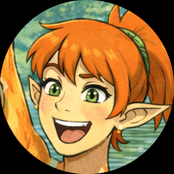

# Ashley Hunter

> “I ain’t changin’ who I am just to make the world quieter.”

---

## Overview

Ashley Hunter is a Sauromorph of the Austroraptorian subspecies.  
She is athletic, loud by nature, deeply self-aware, and fiercely loyal to her own values.

Raised in the countryside on Terra, Ashley struggles with transitions, social misunderstandings, and emotional regulation — but remains grounded in honesty, perseverance, and care for others.

---

## Personality

- Highly self-aware
- Stubborn, but principled
- Loud speaking voice that is often misinterpreted as aggression
- Avoids conflict unless cornered
- Motivated by food, nature, and quiet companionship
- Hates betraying herself more than being disliked

Ashley believes strongly in *being the change she wants to see*, even when it costs her emotionally.

---

## Traits & Quirks

- Difficulty with transitions (mental and physical)
- Vocal stimming when alone (humming, whistling, trumpet-like sounds). Amazing singing voice that she doesn't publicize.
- Avoids competitive activities due to poor emotional regulation when losing
- Fearful of dogs and coyotes due to pack behavior
- Motivated by routine and preparation
- Easily overwhelmed by misunderstandings

---

## Relationships

- **Eric Hunter** — emotional anchor and grounding presence  
- **Lewis (“Newt”) Hunter** — creative enabler and worldbuilding partner  
- **Jeannie Hunter** — mother; relationship marked by care and occasional friction  
- **John Hunter** — father; playful, affectionate, grounding  
- **Amelia** — closest friend; contrast of quiet and loud, city and country  
- **Primal** — trusted companion and partner figure

---

## Biology Notes

- Austroraptorian Sauromorph
- Smaller-bodied subspecies with high metabolism
- Bathroom needs occur suddenly and require preparation
- Feathers are waterproof but not well-insulating
- Capable of extreme physical aggression, but actively suppresses it

---

## Notable Scenes

- [Too Loud Without Meaning To](../scenes/too-loud.md/)
- [Standing Her Ground](../scenes/standing-her-ground.md/)
- [Daddy–Daughter Day](../scenes/daddy-daughter-day.md/)
- [Shortcuts](../scenes/shortcuts.md/)

---

← [Back to Characters](./)
