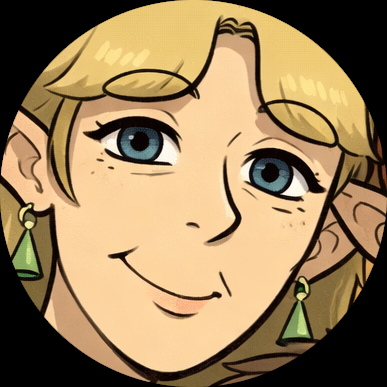

# Jeannie Hunter

> “I just wish y’all would explain it slower.”

---

## Overview

Jeannie Hunter is the matriarch of the Hunter family. Motherly, sharp-witted, and quietly formidable, she balances warmth with boundaries.

She is deeply caring, but not indulgent — and not easily fooled.

---

## Personality

- Nurturing, but firm
- Wise and observant
- Easily overwhelmed by abstract explanations
- Emotionally perceptive
- Not afraid to admit when she’s wrong

Jeannie loves her children fiercely, even when she doesn’t fully understand them.

---

## Interests

- Baking
- Crafting (many rotating hobbies)
- Home-making
- Simple simulator games
- Quiet routines

---

## Traits

- Shortest of the Hunters
- Ages gracefully, aware of her body changing
- Prefers practicality over abstraction
- Easily annoyed by dream talk

---

## Relationships

- **John** — husband; affectionate and teasing
- **Ashley** — daughter; relationship marked by care and occasional friction
- **Eric** — dependable eldest
- **Lewis** — indulged creative
- **Amelia** — treated gently, protectively

---

## Notable Scenes

- [Too Loud Without Meaning To](../scenes/too-loud.md/)
- [The Thing Said Out Loud](../scenes/the-walk.md/)
- [A System That Works](../scenes/a-system-that-works.md/)
- [One From Each Clutch](../scenes/one-from-each-clutch.md/)
---

← [Back to Characters](./index.md)
