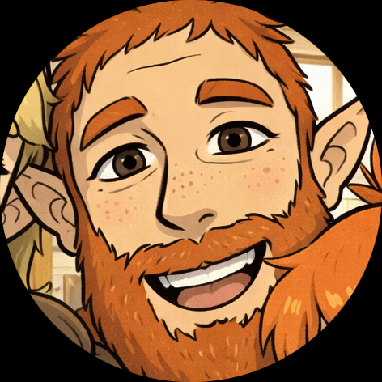

# John Hunter

> “Now that right there’s a ten outta ten.”

---

## Overview

John Hunter is the father of the Hunter family. Confident, playful, and deeply loving, he brings humor and warmth wherever he goes.

He is known for his scruffy beard, terrible nicknames, and unwavering support for his children.

---

## Personality

- Silly and affectionate
- Confident and relaxed
- Generous with praise
- Prone to ridiculous jokes
- Emotionally available

John believes life should be enjoyed, even when it’s difficult.

---

## Interests

- Cooking
- Older open-world RPGs
- Music (alternative rock)
- Firearms and target shooting
- Starting his own business

---

## Traits

- Sleep apnea (worse with whiskey)
- Loud laugh
- Creative nickname-giver
- Treats work clothes as casual clothes

---

## Relationships

- **Jeannie** — wife; steady partnership
- **Ashley** — daughter; deeply bonded (“Mayfly”)
- **Eric** — proud of him
- **Lewis** — amused by him
- **Amelia** — protective fondness

---

## Notable Scenes

- [Daddy–Daughter Day](../scenes/daddy-daughter-day.md/)
- [Gun Range](../scenes/gun-range.md/)
- [Titles Earned Fair and Square](../scenes/titles-earned.md/)

---

← [Back to Characters](./index.md)
